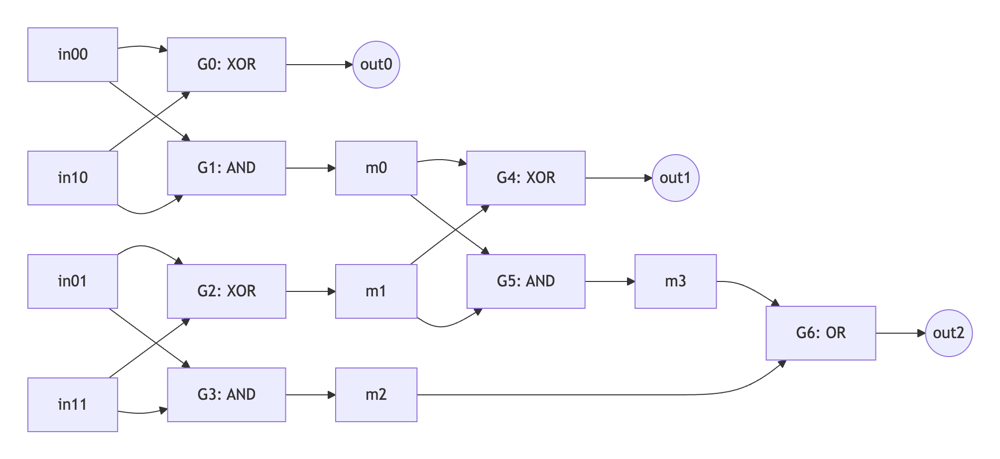

# Goat Delbrag

[Delbrag](https://rubin.io/public/pdfs/delbrag.pdf) uses Garbled Circuits (GCs) to enthance Bitcoin L2 solutions based on [BitVM2](https://bitvm.org/bitvm2.html), streamlining disputes through single-hash disprove transactions. This enables simpler, more accessible Bitcoin L2 scalability.

## Garbled Circuits (GC) Fundamentals​
Garbled Circuits are a cryptographic protocol enabling secure multi-party computation (MPC). They allow two parties (Garbler and Evaluator) to compute a function f(x, y) without revealing private inputs (x from Garbler, y from Evaluator).

### ​Boolean Circuit Representation​​
Computations are represented as Boolean circuits (composed of logic gates, such as AND, XOR, NOT, OR). For example, a 2-bit adder computes Out = In0 + In1 using 7 gates (little-endian: In0 = (in00,in01), In1 = (in10,in11) and Out = (out0, out1, out2)) : 
G0: out0 = in00 ^ in10,
G1: m0 = in00 & in10,  
G2: m1 = in01 ^ in11,  
G3: m2 = in01 & in11, 
G4: out1 = m0 ^ m1,  
G5: m3 = m0 & m1,  
G6: out2 = m2 | m3.  
​
### ​Garbling Process (Garbler's Role)​​:
Garbler generates two 256-bit labels (X, Y) per wire (e.g., X(in00) and Y(in00) indicate in00 = 0 and in00=1 respectively).

After expressing each wire as random labels, Garbler then encrypt gate outputs using cryptographic hashes. For XOR gate G0, four gate outputs Enc0, Enc1, Enc2, Enc3 are calculated using the truth value table of XOR: (0,0)->0; (0,1)->1; (1,0)->1; (1,1)->0.

- Enc0 = X(out0) \oplus H(X(in00) || X(in10)),  
- Enc1: Y(out0) \oplus H(X(in00) || Y(in10)),
- Enc2: Y(out0) \oplus H(Y(in00) || X(in10)), 
- Enc3: X(out0) \oplus H(Y(in00) || Y(in10)).
​
### ​Evaluation (Evaluator's Role)​​:
Garbler transmits shuffled encrypted gate outputs and input labels. Evaluator receives labels:
- Garbler's inputs: Directly provided.
- Evaluator's inputs: Obtained via ​​Oblivious Transfer (OT, a cryptography tool which makes sure Evaluator receive no other labels and Garbler know no nothing about used labels corresponding to valuator's inputs)​​.
Then，

Evaluator decrypts gates sequentially using received labels and final output labels are sent to Garbler for plaintext conversion.

## ​​Delbrag: GC for Bitcoin L2​​
Delbrag optimizes BitVM2’s withdrawal validation by replacing ZKP verification with GCs. Key advantages:
- Commitment Efficiency​​: Only input/output labels are committed on-chain (e.g., H(X(in00)), H(Y(out))).
- ​​Dispute Simplification​​: Validity checks require only label consistency proofs via Bitcoin’s native opcode.

While the specifics of the Delbrag scheme remain subject to public discussion and refinement, we proceed to detail the GOAT Delbrag implementation.

## GOAT Delbrag
GOAT Delbrag extends GOAT BitVM2’s workflow ("Peg-in → Kickoff → Challenge → Assert → Disprove" in most complex casse) while largely reducing Bitcoin transaction complexity.

### GOAT Delbrag Workflow Overview​​

GOAT Network publicly endorses a ​​Boolean circuit-based ZKP verification algorithm​​ for validating withdrawal integrity on Bitcoin, coupled with its ​​garbled circuit (GC) ZKP framework​​ that cryptographically attests to the correct construction of the GC corresponding to the defined Boolean circuit.

- ​Phase 1: Peg-in

  Offline/L2 actions exhibit greater complexity compared to GOAT BitVM2:
  - Operator genenrates the garbled circuit for ZKP verification Boolean circuit and publishes all encrypted gate outputs.
  - Operator generates a ​​ZK proof attesting to the garbled circuit's construction correctness (label consistency and encryption validity).
  - L2 veiriy the validity of the garble circuit‘s construction and then mint L2 assets.

  ​Actions on Bitcoin​​:
  - Input label commitment​​: Commit to input wire labels (e.g., publish H(X(in00)), H(Y(in00)) via Taproot locking scripts).
  - Output label commitment: Commit to output wire labels (output is 0 for invalid and 1 for valid in varification algorithm, publish H(X(out)), H(Y(out))).
  - ​Error penalty via Taproot Tree​​​​: Invalid input label disclosure or incorrect output label revelation will trigger penalty execution (i.e., disprove transaction). 

- ​Phase 2: Kickoff
  - Operator submits plaintext ZK proof (including valid L2 state).

- ​​Phase 3: Challenge 
  ​The Challenger initiates a challenge when offline verification confirms the submitted proof is invalid.
- Phase 4: Assert
  Operator reveals all input labels on Bitcoin network under challenge.
- Phase 5: Disprove
  The Challenger triggers penalty mechanisms upon detecting protocol vialations:
  - ​Input label inconsistency​​ with committed values during the Peg-in process or with plaintext proof,
  - ​​Invalid final output​​ (0 returned where verification requires 1).

### Key Benefits and Future Optimization Directions​​

Compared to GOAT BitVM2, ​​GOAT Delbrag substantially enhance on-chain efficiency through reduction on-chain operations​​:
- ​​Minimized commitment data​​ (input/output labels for ZKP proof garble circuit),
- ​Simplified dispute resolution​​ (single-step disprove transaction after Operator reveals input labels).

However, it also introduces ​​increased off-chain overhead​​ due to:
- High-volume garbled circuit gate ciphertexts,
- Time-intensive ZK proofs for garnble circuit construction validity.
Thus, ​​reducing offline data volume​​ and ​​accelerating proof computation​​ remain key optimization priorities for GOAT Delbrag.